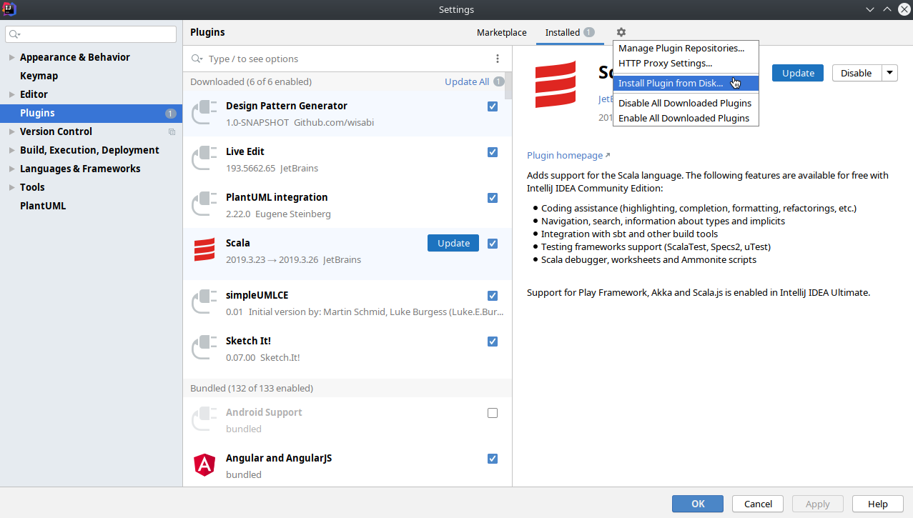
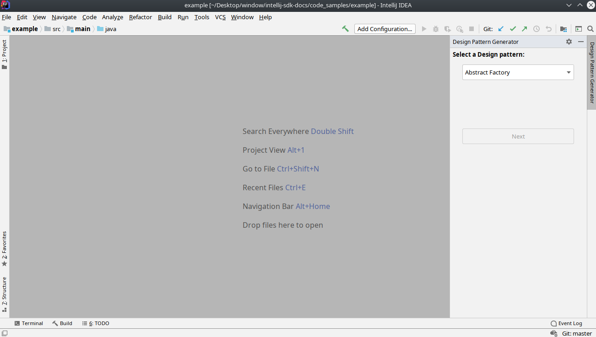
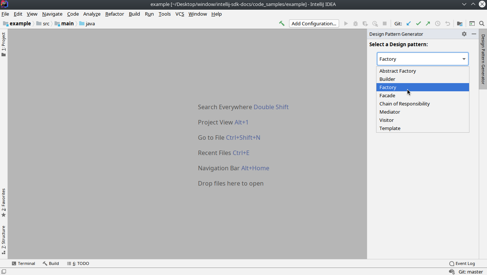
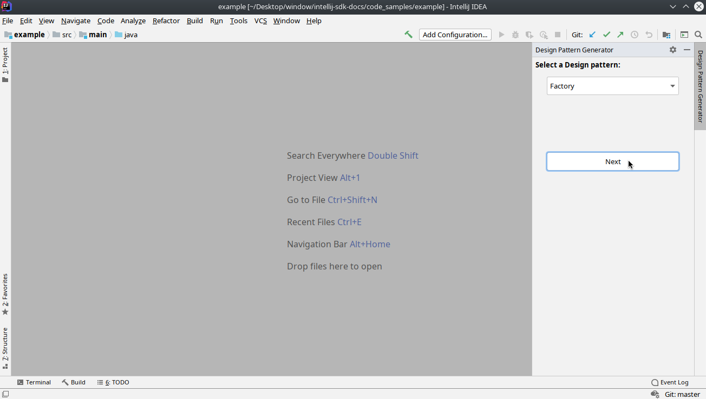
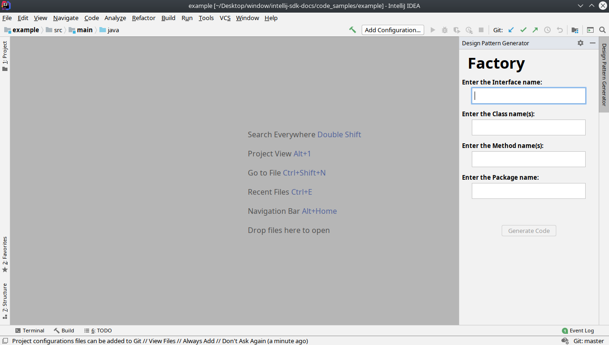
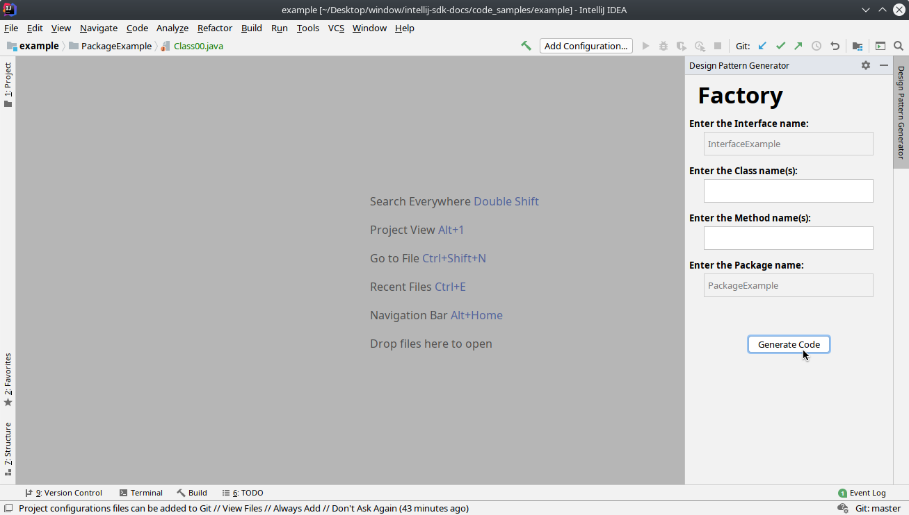
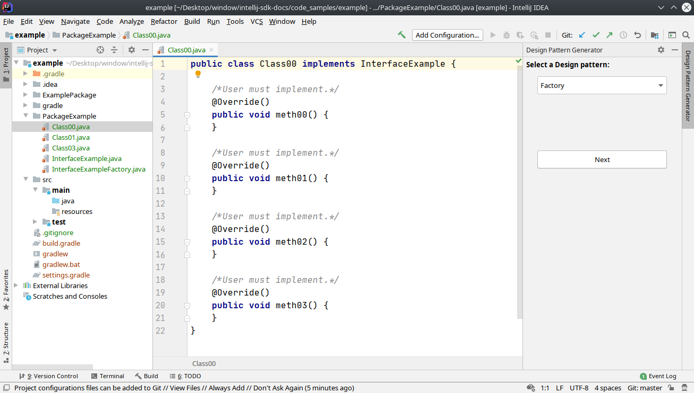

# Design Pattern Generator Plugin for IntelliJ
Wisam Abunimeh  
CS474, Spring 2020

## Description
This application is a plugin for IntelliJ. It generates Java design pattern code based on a user's input and preferences. Users are prompted to choose from the following design patterns to generate:

* Abstract Factory  
* Builder  
* Factory  
* Facade  
* Chain of Responsibility  
* Mediator  
* Visitor  
* Template  

Users will also be prompted about class, interface, and method identifiers in order to generate each design pattern. The user will also be prompted to provide a package name to save these generated .java files. The packaged directory will be saved at the user's project root.

## Design Implementation
The DePaCoG project design applies three design patterns: Singleton, Factory, and Template.

#### Singleton
Logging is implemented using a Singleton design pattern. When the DePaCoG application is executed, a new logging object is instantiated and begins logging immediately. Each time a new class is instantiated outside the TheToolWindow() scope, the logging method getLogger is called to return the single instantiated object. This ensures only one logging object exists within the whole DePaGenPlugin system and that single instance is accessible from the whole system. The advantage of using a Singleton design pattern for logging is that a single logger will be implemented from the very beginning of the program to the very end, rather than have many loggers created and destroyed within the lifespan of the application run time. Another advantage is logging is not dependent on a single class because any class that wants a logger, will get a logger by either creating the single logger instance or getting the already created logger.

#### Factory 
The Factory design pattern is implemented to create the objects for generating one of the eight design patterns GUI pages. The eight design pattern generating classes all extend the abstract class DesignPageTemplate. The Factory class DesignPageFactory instantiates one of the eight design pattern GUI page classes based on user input. The advantage of using the Factory design pattern in this implementation is the creation of each pattern is abstracted to a common method without a client/user of code invoking the constructor of each individual class. A disadvantage of this implementation of the Factory method is there must be one concrete class for each design pattern GUI page. Every time a new design were to be added, a new class would have to be created which adds to the totality of the codebase. 

#### Template
A Template design pattern is used to define the skeleton code for the subclasses of the Abstract DesignPattern class. The Template defines the behavior by plotting abstract methods and by defining a final method executePatternGeneration(). The final method executePatternGeneration is a common algorithm that depends on a subclass's implementation of the abstract methods. The advantage of using this design pattern is it avoids code duplications as executePatternGeneration is common for all subclasses.  A disadvantage to this implementation of the Template design pattern is if executePatternGeneration had to be modified for a certain subclass, there is no mechanism in doing so because executePatternGeneration is a final method.

## Installation
To use the plugin properly, be sure to have the following software installed:  

* Java Version 1.8. Install from: https://www.oracle.com/java/technologies/javase-jdk8-downloads.html  
* Gradle 6.0.0 or newer. Install from: https://gradle.org/install/  
* IntelliJ IDEA. Install from: https://www.jetbrains.com/idea/download/  
* DePaGenPlugin. Clone from: https://wabuni2@bitbucket.org/wabuni2/homework2.git  

#### Steps to run the plugin from the command line
1. Navigate to project root folder ../DePaGenPlugin/  
2. Execute "gradle clean"  on the command line.  
3. Execute "gradle build"  on the command line.  
4. Execute "gradle run"  on the command line.  

This will open a new instance of IntelliJ IDEA. The plugin will be docked on the right-vertical toolbar. 

#### Steps to install the plugin to IntelliJ
1. Navigate to project's root folder ../DePaCoG/  
2. Execute "gradle clean"  on the command line.  
3. Execute "gradle buildPlugin"  on the command line.  
4. From IntelliJ IDEA, Navigate to Settings → Plugins → Install Plugin from Disk

5. Select ../DePaGenPlugin/build/distributions/DePaGenPlugin-1.0-SNAPSHOT.zip
6. Restart IntelliJ, and the plugin will be docked on the right-vertical toolbar.

## Usage  
1. The Design Pattern Generator plugin is shown on right sidebar.

2. Use the dropdown menu to selct a Design Pattern.

3. Click the next button.

4. Enter the Design Pattern attributes (press enter once attribute is typed). If an attribute is singular (e.g. Factory pattern having a single interface), the entry field will be disabled once entered. If an attribute can have more than one (multiple methods), then the textfield dissapear once enterd to allow for more attributes to be entered.

5. Once all entries are entered, click on the Generate Code button to create the package.

6. The package will be saved to the project's root folder.

## Testing
Follow the [instructions](#Steps-to-run-the-plugin-from-the-command-line)  from above  to ensure the project is runnable.
#### Steps to test the application
1. Navigate to project's root folder ../DePaCoG/  
2. Execute "gradle clean"  on the command line.  
3. Execute "gradle build"  on the command line.  
4. Execute "gradle test"  on the command line.  

Once testing has completed, the testing report appears here:  
../DePaGenPlugin/build/reports/tests/test/index.html

## Logging
Log files can be found in the ~/DePaGenPluginLogs/ directory. Log files follow the log-YYYY-MM-DD.log naming format. 

## References 
The following resources were used: 

* The Java Language Specification, https://docs.oracle.com/javase/specs/jls/se11/html/index.html
* The GoF Design Patterns Reference, https://w3sdesign.com/GoF_Design_Patterns_Reference0100.pdf  
* Javaparsar, https://javaparser.org/
* Design Patterns in Java Tutorial, https://www.tutorialspoint.com/design_pattern/  
* Gradle Documentation, https://docs.gradle.org/current/userguide/userguide.html  
* SLF4J Manual, http://www.slf4j.org/manual.html  
* JUnit Documentation, https://junit.org/junit4/javadoc/4.12/org/junit/package-summary.html  
* IntelliJ Platform SDK, https://www.jetbrains.org/intellij/sdk/docs/intro/welcome.html  
* Swing Documentation, https://docs.oracle.com/javase/8/docs/api/javax/swing/package-summary.html  
